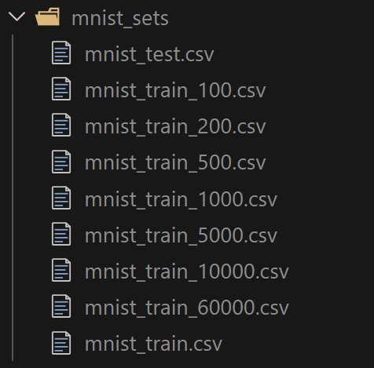

# Neural Network built from scratch in C# 
Neural Network built from scratch in C#

## Introduction
This Neural Network is the result of one of my learnings. I was intrigued by the parcel detection capabilities of my Google Nest doorbell (2nd gen). I wanted to know how it was possible for such a low powered device to do the parcel detection, even when running offline. 
For my learning purposes I wrote a network that is capable of recognizing handwritten numbers, as there is a good set of test data available from NIST.  

The code of the Neural Network is very generic. You can use it to classify any type of object. You might need to change the number of input parameters, layers, nodes on the hidden layer and the number of LABELS. Don't forget to assign a symantic value to the output label.

**Happy coding!**

## Main Classes / functionalities. 
The main functionalities include training the neural network with data from files and testing the neural network's performance with test data. Here are the key components:

1. Neural Network Class (NeuralNetwork.NeuralNetwork):

- Defines the structure of the neural network with input, hidden, and output nodes.
- Implements methods for training (`Train`), querying (`Query`), and testing (`Test`) the neural network.
- Includes utility methods like `Sigmoid` for activation, `InitializeBiasedMatrix` for initializing matrices, and methods for serializing/deserializing the network state to/from JSON.

2. Program Class (NeuralNetwork.Program):

- Contains the `Main` method which is the entry point of the application.
- Implements methods to train the neural network from a file (`TrainFromFile`) and test the neural network from a file (`TestFromFile`).

3. Training and Testing:

- The `TrainFromFile` method reads training data from a file, processes it, and trains the neural network.
- The `TestFromFile` method reads test data from a file, processes it, and evaluates the neural network's performance, printing the results to the console.

The program is designed to read data from CSV files, train the neural network with this data, and then test the network's accuracy. The results of the tests are printed to the console, showing the success or failure of each test case and the overall accuracy.

## Explanation of the Sigmoid (activator) function
The `Sigmoid` function is a type of activation function used in neural networks. Its primary purpose is to introduce non-linearity into the model, allowing the network to learn complex patterns. The `Sigmoid` function maps any input value to a value between 0 and 1, which is particularly useful for binary classification problems.

Here is a step-by-step explanation of its purpose:

Non-linearity: Without non-linear activation functions like `Sigmoid`, a neural network would behave like a linear model, regardless of the number of layers. This would severely limit the network's ability to model complex data.

Output Range: The `Sigmoid` function squashes the input values to a range between 0 and 1. This is useful for interpreting the output as probabilities, especially in the output layer of a binary classification network.

Gradient Descent: The `Sigmoid` function has a well-defined derivative, which is essential for backpropagation. The derivative of the `Sigmoid` function is simple to compute and helps in updating the weights during training.

The mathematical formula for the `Sigmoid` function is:

[ sigma(x) = frac{1}{1 + e^{-x}} ]

Where ( e ) is the base of the natural logarithm, and ( x ) is the input to the function.

## Test data
Test data can be found as a zip file in the folder TrainingData. What I did for the experimentation is chopping up the testing data in multiple chunks

The program in the `PrepareDataSets` folder is a utility to preprocess the raw data, making it suitable for training and testing the neural network. It handles tasks such as splitting the data into manageable chunks, normalizing the input features, and saving the processed data for further use.

